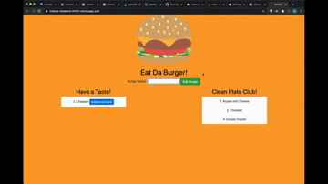

# Eat Da Burger

  
## Table of Contents
- [Description](#description)
- [Installation](#installation)
- [Usage](#usage)
- [License](#license)
- [Contributing](#contributing)
- [Tests](#tests)
- [Questions](#questions)
    
  
## Description
This application allows the user to log a burger or multiple burgers of their choice, and then devour each burger.  It was created with MySQL, Node, Express, Handlebars and a homemade ORM following the MVC design pattern.

## Installation 
The applicatoin requires no installation to use.  It is deployed through Heroku and can be run by [clicking this link](https://intense-headland-97651.herokuapp.com/) to open the page in your default browser.

## Usage
To name a burger the user enters their text into the html input.  When they finish and click the 'Add Burger' button their burger is then rendered to a column titled 'Have a Taste!'. Beside the burger is a button labeled 'Gobble me down!' so the user can then eat the burger.  Once it has been eaten the corresponding burger is then moved to the 'Clean Plate Club!' column.  

## License
Copyright (c) 2020 robkellen
  
MIT License
    
Permission is hereby granted, free of charge, to any person obtaining a copy of this software and associated documentation files (the "Software"), to deal in the Software without restriction, including without limitation the rights to use, copy, modify, merge, publish, distribute, sublicense, and/or sell copies of the Software, and to permit persons to whom the Software is furnished to do so, subject to the following conditions:
    
The above copyright notice and this permission notice shall be included in all copies or substantial portions of the Software.
  
THE SOFTWARE IS PROVIDED "AS IS", WITHOUT WARRANTY OF ANY KIND, EXPRESS OR IMPLIED, INCLUDING BUT NOT LIMITED TO THE WARRANTIES OF MERCHANTABILITY, FITNESS FOR A PARTICULAR PURPOSE AND NONINFRINGEMENT. IN NO EVENT SHALL THE AUTHORS OR COPYRIGHT HOLDERS BE LIABLE FOR ANY CLAIM, DAMAGES OR OTHER LIABILITY, WHETHER IN AN ACTION OF CONTRACT, TORT OR OTHERWISE, ARISING FROM, OUT OF OR IN CONNECTION WITH THE SOFTWARE OR THE USE OR OTHER DEALINGS IN THE SOFTWARE.

## Contributing
To contribute to this project please email me at rob.h.kellen@gmail.com.

## Tests
To test the functionality of this app please give it a try on the webpage, or fork the repo to test out the code.  
  
## Questions
Please email me at rob.h.kellen@gmail.com with any questions about this project.  You can also see more of my work by visiting my GitHub profile at [robkellen](https://github.com{userName}).

